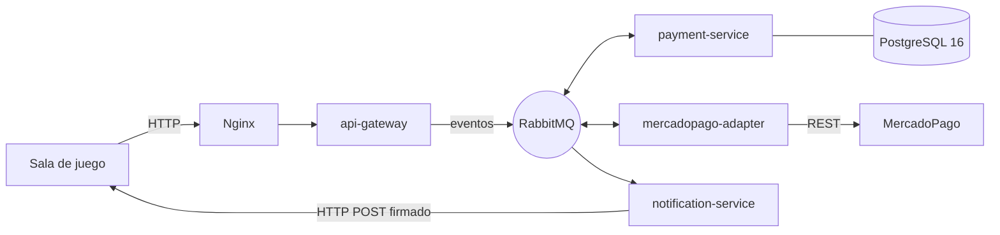

# 📚 Capacitación: Programación orientada a eventos

## Pasarela de pagos GWP ("GiveMeMoney")

> Documento autoguiado, por etapas, pensado para **imprimir y leer durante la semana**.
> Después vas a contrastar todo esto con el código real cuando tengas acceso al repo.

---

### ⚠️ Antes de empezar: dos aclaraciones honestas

1. **Versiones:** la documentación interna menciona **Java 21 / Spring Boot 3.5**. Vos creías que podía ser Java 23. Como este material se armó **sin acceso al repositorio**, uso **Java 21 / Spring Boot 3.5 como referencia**. Es un dato a **confirmar** mirando los archivos de build (`pom.xml` o `build.gradle`, la propiedad `<java.version>` / `sourceCompatibility`) cuando entres al código.

2. **Nombres de código:** este documento **no inventa** nombres de clases, paquetes ni rutas de archivos. Los **exchanges, colas y eventos** sí son los reales (figuran en la doc de arquitectura). Cuando te diga "buscá la clase de configuración de RabbitMQ", es a propósito genérico: el nombre exacto lo confirmás vos en el repo.

---

### 🎯 Para qué es esta capacitación

Venís de monolitos Spring sincrónicos: un request entra, viajás por capas, llamás servicios, golpeás la base, devolvés respuesta — todo en el mismo hilo, todo "ahora". GWP es otra cosa: **microservicios que se hablan por eventos**, asíncronos y desacoplados, sobre RabbitMQ. El objetivo de la semana es que cuando abras el código no veas magia, sino patrones que ya entendés.

No te voy a explicar lo que ya sabés (qué es un `@Service`, un hilo, una transacción). Me concentro en lo nuevo: **mensajería, asincronía, hexagonal/CQRS, Outbox, consistencia eventual e infraestructura K8s**.

---

### 🗺️ Mapa del documento

| # | Etapa | Archivo | Lectura |
|---|-------|---------|:---:|
| 📑 | **Índice** (este archivo) | `00-indice.md` | 5 min |
| 0 | **Por qué eventos** | `etapa-0-por-que-eventos.md` | 15 min |
| 1 | **Vocabulario de mensajería** | `etapa-1-vocabulario-mensajeria.md` | 20 min |
| 2 | **RabbitMQ en este proyecto** | `etapa-2-rabbitmq-en-el-proyecto.md` | 25 min |
| 3 | **Hexagonal + Clean + CQRS** | `etapa-3-hexagonal-clean-cqrs.md` | 30 min |
| 4 | **Recorrido de los 4 microservicios** | `etapa-4-recorrido-microservicios.md` | 35 min |
| 5 | **Patrones que tenés que entender sí o sí** | `etapa-5-patrones.md` | 35 min |
| 6 | **Flujos end-to-end** | `etapa-6-flujos-end-to-end.md` | 40 min |
| 7 | **Infraestructura y "verlo correr"** | `etapa-7-infraestructura.md` | 30 min |
| 8 | **Consolidar** | `etapa-8-consolidar.md` | 20 min |
| A | **Apéndice — Fundamentos de Docker y Kubernetes** | `apendice-A-fundamentos-docker-k8s.md` | 35 min |
| ✅ | **Respuestas** | `99-respuestas.md` | — |

**Total:** ~5 h 25 min de lectura.

> 📎 **Sobre el Apéndice A:** la Etapa 7 te enseña a *operar* la infraestructura; el Apéndice A te enseña a *entender la maquinaria* (contenedores, labels/selectors, DNS interno, PV/PVC, Minikube) desde cero. Si nunca tocaste Docker/K8s, leelo **junto con** la Etapa 7 (o justo antes).

---

### 🧭 Cómo está armada cada etapa

Todas siguen la **misma estructura**, a propósito, para que estudies con ritmo:

1. **🎯 Objetivo** — qué te llevás, en 2-3 líneas.
2. **📖 Teoría** — explicación didáctica. **Analogía con Java/Spring primero, código después.**
3. **🔍 En nuestro sistema** — el mapeo a GWP con los nombres reales.
4. **📂 Qué buscar en el código (para la semana)** — qué tipo de archivo abrir cuando tengas el repo.
5. **❓ Preguntas para verificar** — 3 a 5; las respuestas están todas juntas en `99-respuestas.md`.
6. **✍️ Mini-ejercicio** — lectura y trazado mental, no escribir el sistema.

---

### 🗓️ Ruta sugerida para la semana

| Día | Etapas | Idea |
|-----|--------|------|
| **Lunes** | 0 + 1 | El *porqué* y el vocabulario base |
| **Martes** | 2 + 3 | RabbitMQ concreto + organización de capas |
| **Miércoles** | 4 | Los 4 servicios, de una sentada |
| **Jueves** | 5 + 6 | Patrones + flujos completos (el corazón del sistema) |
| **Viernes** | 7 + Apéndice A + 8 | Infra (operar + entender la maquinaria) y cierre |
| **Finde** | repaso | Preguntas de verificación + mini-ejercicios |

---

### 🏗️ Vista de pájaro del sistema (para tener a mano)

GWP permite a las **salas de juego** procesar pagos electrónicos vía proveedores como **MercadoPago**. Recibe solicitudes, genera órdenes QR, captura confirmaciones por webhook y notifica a los clientes — **todo asíncrono y desacoplado**.

**4 microservicios:**

- **api-gateway** — único punto de entrada HTTP, *stateless*, sin BD. Valida y convierte requests en eventos que publica a RabbitMQ. Responde `202`/`200` sin bloquear.
- **payment-service** — el orquestador central (*Aggregate Root*), 100% event-driven, sin HTTP. Consume 9 colas, persiste en PostgreSQL, publica a 6 exchanges. Implementa **Transactional Outbox** y tiene schedulers internos.
- **mercadopago-adapter** — adaptador de salida hacia la API de MercadoPago. *Stateless*, valida webhooks con HMAC-SHA256, reintentos con DLQ.
- **notification-service** — adaptador de salida HTTP: convierte eventos en POST firmados hacia los webhooks de cada cliente, con backoff exponencial.

> El diagrama es la postal. En la **Etapa 6** lo recorremos mensaje por mensaje.

---

**Siguiente:** `etapa-0-por-que-eventos.md`
