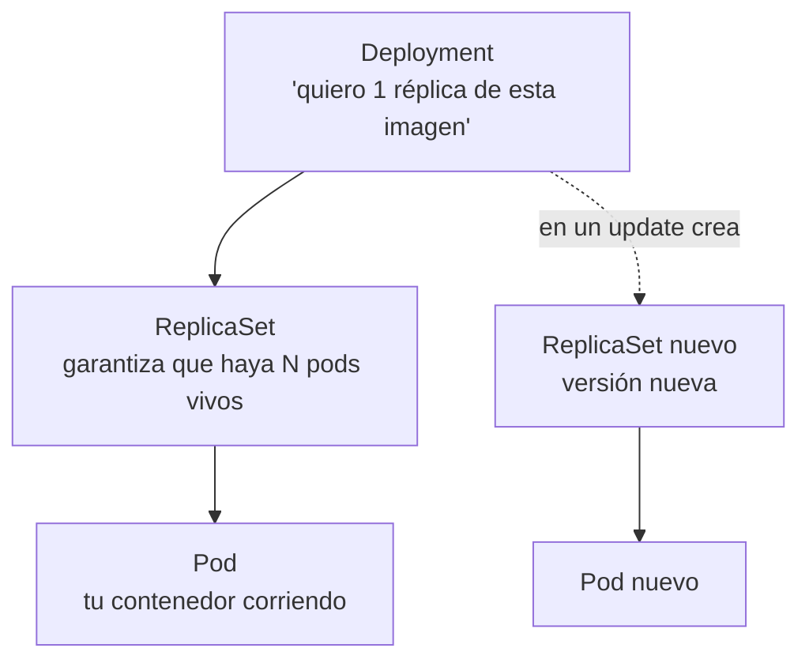
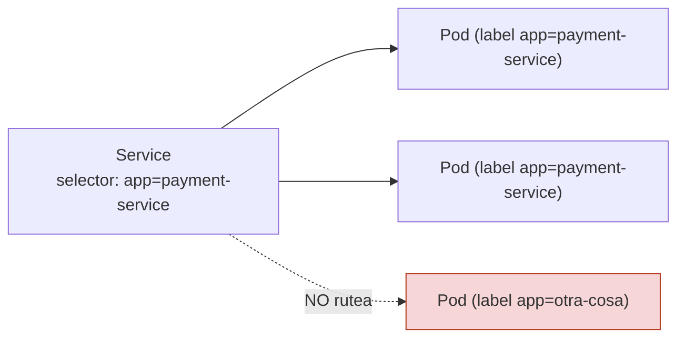
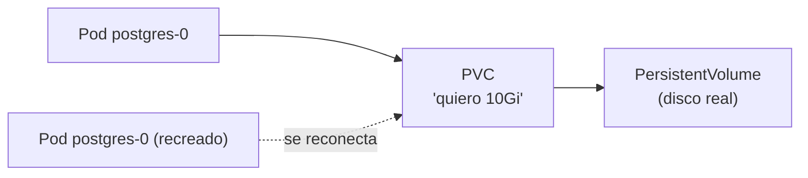

# Apéndice A — Fundamentos de Docker y Kubernetes desde cero

## 🎯 Objetivo del apéndice

Que entiendas **la maquinaria** que la Etapa 7 usaba sin abrir del todo. La Etapa 7 te enseñó a **operar** (mirar pods, abrir la UI, ver logs); este apéndice te enseña a **entender** cada pieza por dentro, partiendo de tu mundo de `.jar` en un Tomcat. Si la Etapa 7 era el manual del piloto, esto es el curso de cómo vuela el avión.

> Todo lo de acá es **conceptual y genérico** (no depende del repo de GWP). Los `.yaml` son **ilustrativos**: el real puede variar en nombres y detalles, que confirmás en los manifiestos del proyecto.

---

## 📖 Teoría

### A.1 — Imagen, contenedor y registry (la base de todo)

Esta distinción es la que más confunde al principio, y sin ella nada cierra. Tres conceptos:

- **Imagen** — la *plantilla* inmutable: un paquete de solo-lectura con tu app + todo lo que necesita (binario/runtime, libs, config base). No corre; es como un molde.
- **Contenedor** — una *instancia en ejecución* de una imagen. De una imagen podés levantar 1, 5 o 50 contenedores idénticos. Es como pasar de la `class` al `new` que la instancia.
- **Registry** — el *repositorio* de imágenes (Docker Hub, un registry privado de la empresa). Hacés `push` para subir una imagen y los nodos hacen `pull` para bajarla antes de correrla.

> **Analogía directa con tu mundo:** la **imagen** es el `.jar` empaquetado *junto con la JVM y el SO mínimo* (no solo tu código, sino el plato servido entero). El **contenedor** es ese `.jar` **ejecutándose** (`java -jar ...` corriendo). El **registry** es como tu **Nexus/Artifactory**, pero de imágenes en vez de `.jar`.

**El Dockerfile y las capas.** Una imagen se construye con un `Dockerfile`: una receta paso a paso. Cada instrucción genera una **capa** cacheada, así que reconstruir es rápido si solo cambió lo de arriba.

```dockerfile
# Ejemplo ILUSTRATIVO — multi-stage con build nativo GraalVM
# Etapa 1: compilar a binario nativo (imagen pesada, con todo el toolchain)
FROM ghcr.io/graalvm/native-image AS build
COPY . /app
RUN cd /app && ./mvnw -Pnative native:compile

# Etapa 2: imagen final mínima — solo el binario, sin JVM ni Maven
FROM debian:stable-slim
COPY --from=build /app/target/app /app/app
ENTRYPOINT ["/app/app"]
```

El **multi-stage** es la clave del build nativo de GWP: la primera etapa (enorme: trae GraalVM, Maven, todo el toolchain) compila; la segunda **copia solo el binario** a una imagen mínima. Resultado: una imagen chica con un ejecutable que arranca en milisegundos. Por eso GWP puede correr varios pods livianos sin el costo de arranque/RAM de la JVM.

---

### A.2 — Qué es `kubectl` y el "context"

`kubectl` es **el cliente de línea de comandos** que le habla al cluster. No "ejecuta" nada localmente: manda órdenes al **API server** de Kubernetes por HTTPS y te muestra la respuesta.

¿A qué cluster le habla? Eso lo define el **kubeconfig** (por defecto `~/.kube/config`), que guarda **contexts**: cada context es la terna *(cluster + usuario + namespace por defecto)*. Minikube, al arrancar, te crea y selecciona su context automáticamente.

```bash
kubectl config current-context     # ¿a qué cluster le estoy hablando?
kubectl config get-contexts        # todos los contexts disponibles
kubectl config use-context minikube
```

> **Por qué te importa:** si alguna vez un comando "no encuentra" tus pods, lo primero es chequear que `kubectl` esté apuntando al cluster correcto (el context). Es el equivalente a "¿me conecté a la base que creía?".

---

### A.3 — La jerarquía: Deployment → ReplicaSet → Pod

En la Etapa 7 viste Pod y Deployment sueltos. En realidad hay una **cadena de mando**:



- **Pod** — la unidad mínima: 1 (o más) contenedores que comparten red y viven/mueren juntos. Es **efímero**: si se cae, *ese* pod no "revive" — nace **uno nuevo** con otro nombre/IP.
- **ReplicaSet** — el que **cuenta**: "tienen que haber N pods vivos". Si uno muere, levanta otro. Vos casi nunca lo tocás directo.
- **Deployment** — el que **gestiona versiones**: declarás la imagen y cuántas réplicas; cuando cambiás la imagen (deploy nuevo), el Deployment crea un **ReplicaSet nuevo** y va moviendo pods del viejo al nuevo (**rolling update**), pudiendo hacer **rollback** si algo sale mal.

> **Analogía:** el **Deployment** es el supervisor que dice "quiero 1 operario haciendo esta tarea, versión 5 del manual". El **ReplicaSet** es el capataz que se asegura de que **siempre haya 1 operario vivo** (si se desmaya, mete otro). El **Pod** es el operario concreto, reemplazable.

**Por qué "efímero" cambia tu forma de pensar:** como los pods van y vienen con IP distinta, **nunca** le hablás a un pod por su IP. Para eso existe el Service (A.5). Y como un pod puede morir en cualquier momento, **su estado en disco se pierde** salvo que uses almacenamiento persistente (A.7) — por eso Postgres no puede ser un Pod común.

---

### A.4 — Labels y selectors (el pegamento de Kubernetes)

Acá está **el mecanismo más importante** y el que la Etapa 7 no abría: **¿cómo sabe un Service a qué pods mandarles tráfico?** No por nombre ni por IP. Por **etiquetas (labels)**.

- Un **label** es un par clave-valor que le pegás a un objeto: `app: payment-service`, `tier: backend`.
- Un **selector** es una *consulta* por labels: "todos los pods con `app=payment-service`".

Casi todas las conexiones de K8s funcionan así: un Deployment sabe qué pods son "suyos" por selector; un Service sabe a qué pods rutear por selector.

```yaml
# Ejemplo ILUSTRATIVO — el Service encuentra a sus pods por label
apiVersion: v1
kind: Service
metadata:
  name: payment-service
spec:
  selector:
    app: payment-service     # <-- rutea a TODO pod con este label
  ports:
    - port: 8080
```



> **Analogía:** el selector es un `WHERE label = 'payment-service'`. El Service no tiene una lista fija de pods; **pregunta dinámicamente** "¿quiénes matchean?" y reparte entre ellos. Por eso cuando un pod muere y nace otro (con otra IP) el Service **se acomoda solo**: el nuevo pod tiene el mismo label, así que entra a la rotación sin que nadie toque nada.

Esto es lo que hace que el sistema sea *self-healing*: las piezas se encuentran por **identidad lógica (labels)**, no por dirección física.

---

### A.5 — Service y DNS interno (cómo se encuentran los servicios)

Un **Service** te da dos cosas estables sobre un grupo de pods efímeros: una **IP virtual fija** y, sobre todo, un **nombre DNS**. Kubernetes corre un DNS interno: cada Service es resoluble por su nombre **dentro del cluster**.

Esto responde la pregunta que quedaba colgada: *¿cómo sabe el payment-service dónde está PostgreSQL o RabbitMQ?* **Por nombre.** En su configuración, la URL de la base no es una IP: es algo como `postgres-service:5432`, y el de RabbitMQ `rabbitmq-service:5672`. El DNS del cluster traduce ese nombre a la IP del Service, que a su vez reparte a los pods.

```
# Nombre DNS completo de un Service (forma larga)
<service>.<namespace>.svc.cluster.local
ej.: postgres-service.dev.svc.cluster.local
# Dentro del mismo namespace alcanza con el nombre corto: "postgres-service"
```

**Repaso de los tipos** (ya en la Etapa 7), ahora con el "por qué":
- **ClusterIP** (default) — IP/nombre **solo interno**. Es como hablan entre sí los servicios de GWP. No accesible desde afuera.
- **NodePort** — abre un puerto en el nodo hacia afuera (`:30000` del api-gateway). Es la "puerta de calle".
- **Headless** (`clusterIP: None`) — **no** da una IP única; en cambio expone **un DNS por cada pod** (`rabbitmq-0.<service>...`). Se usa con StatefulSets, donde te importa hablarle a *un pod específico* por su identidad estable, no a "cualquiera del montón".

> **Analogía:** el Service es un **número de interno** de la empresa (siempre el mismo) que el conmutador (DNS + balanceo) deriva al empleado disponible. Vos llamás al interno "Contaduría", no al celular personal de Juan, que cambia.

---

### A.6 — ConfigMap y Secret: cómo entran de verdad al contenedor

La Etapa 7 dijo *qué* son. Falta el *cómo*: la config no se "lee mágicamente", se **inyecta** al pod de una de dos formas:

1. **Como variables de entorno** — cada clave del ConfigMap/Secret se vuelve un `ENV` que tu app lee (en Spring Boot, eso alimenta tus `@Value`/`application.yml` vía variables de entorno).
2. **Como archivos en un volumen montado** — el ConfigMap/Secret aparece como archivos dentro del contenedor (ej. `/etc/secrets/webhook-secret`).

```yaml
# Ejemplo ILUSTRATIVO — inyectar config como env vars
envFrom:
  - configMapRef: { name: payment-config }   # URLs, flags
  - secretRef:    { name: payment-secrets }  # tokens, passwords
```

**El malentendido peligroso que tenés que sacarte de encima:** un **Secret NO está encriptado**. Su contenido está en **base64**, que es solo una *codificación* (cualquiera lo decodifica en dos segundos). La diferencia real con un ConfigMap es de **control de acceso y manejo** (RBAC, no se loguea, se puede cifrar en reposo si el cluster lo configura), no de "está escondido". Por eso los **tokens de MercadoPago y los webhook secrets por cliente** van en Secrets: para tratarlos con cuidado, no porque base64 los proteja.

```bash
# Esto "desencripta" un Secret... porque nunca estuvo encriptado:
echo "dG9rZW4tc2VjcmV0bw==" | base64 -d
```

---

### A.7 — Persistencia real: PV, PVC y por qué Postgres es un StatefulSet

Recordá A.3: un pod es **efímero**, y lo que escribe en su disco **se borra** cuando muere. Para una base de datos eso es inaceptable. La solución de Kubernetes son **volúmenes persistentes**, con dos piezas:

- **PersistentVolume (PV)** — un pedazo de almacenamiento *real* del cluster (un disco). Existe independientemente de los pods.
- **PersistentVolumeClaim (PVC)** — un *pedido* de almacenamiento que hace un pod: "necesito 10Gi". Kubernetes lo **vincula** a un PV que lo satisfaga. El pod usa el PVC; si el pod muere y nace otro, el nuevo **se reconecta al mismo PVC** y recupera los datos.



**Acá cierra lo del StatefulSet** (de la Etapa 7): un **StatefulSet** existe justamente para cargas con estado. A diferencia de un Deployment, le da a cada pod:
1. **Identidad estable** — nombres fijos y ordenados (`postgres-0`, `rabbitmq-0`), no aleatorios.
2. **Su propio PVC persistente** — atado a *ese* pod. Si `postgres-0` se recrea, vuelve a engancharse a su mismo disco. Los datos sobreviven.

Por eso Postgres y RabbitMQ **no pueden** ser Deployments comunes: perderían identidad y datos en cada reinicio. Los microservicios de GWP sí son Deployments porque son **stateless** (su "estado" vive en Postgres o en las colas, no en su disco).

> **Analogía:** un Deployment es personal *temporario* intercambiable (cualquiera hace la tarea, no tiene escritorio fijo). Un StatefulSet es personal *con escritorio asignado y archivero propio*: `postgres-0` siempre vuelve a SU archivero (PVC), aunque la persona cambie.

---

### A.8 — Minikube por dentro y el error que SÍ o SÍ vas a tener

**Minikube** no es Kubernetes "instalado en tu Windows": es un **cluster de 1 nodo corriendo dentro de una VM o un contenedor** en tu máquina. Tiene **su propio Docker/almacén de imágenes, separado del Docker de tu laptop**. Y ahí está la trampa número uno del que arranca:

> **`ImagePullBackOff` / `ErrImagePull`:** construiste la imagen en *tu* Docker, hacés `kubectl apply`, y el pod queda en `ImagePullBackOff`. ¿Por qué? Porque Minikube busca la imagen en **su** almacén (o en un registry remoto) y **ahí no está**: la imagen vive en el Docker de tu host, que Minikube no ve.

Las salidas habituales (confirmá cuál usa GWP en su documentación de arranque):

```bash
# Opción A: cargar la imagen de tu host al almacén de Minikube
minikube image load mi-imagen:tag

# Opción B: construir directamente DENTRO del Docker de Minikube
#  (apunta tu CLI de Docker al daemon de Minikube en esta shell)
eval $(minikube docker-env)     # en PowerShell: minikube docker-env | Invoke-Expression
docker build -t mi-imagen:tag .

# Y que el Deployment NO intente bajarla de internet:
#   imagePullPolicy: IfNotPresent  (o Never para imágenes 100% locales)
```

Otros dos comandos de Minikube que te van a servir:
```bash
minikube start                       # levanta el cluster
minikube service <svc> -n dev --url  # te da una URL accesible a un NodePort
minikube dashboard                   # la UI visual (ya la viste en Etapa 7)
```

> **Por qué te lo marco fuerte:** este error desconcierta a *todos* los que empiezan ("¡pero si la imagen existe, la acabo de construir!"). Entender que Minikube tiene su propio almacén te ahorra una tarde de frustración.

---

### A.9 — Liveness y readiness probes (por qué un pod "reinicia solo")

Kubernetes no sabe si tu app *está sana* solo porque el proceso vive. Para eso le das **probes**:

- **Liveness probe** — "¿sigue vivo y sano?". Si falla repetidamente, K8s **mata y recrea** el pod. Un servicio colgado (deadlock) se recupera solo.
- **Readiness probe** — "¿está listo para recibir tráfico?". Si falla, K8s lo **saca del Service** (no le rutea) hasta que se recupere, sin matarlo. Útil en el arranque o cuando un dependiente (RabbitMQ) todavía no está.

> **Conexión con la Etapa 8:** cuando ves un pod en `CrashLoopBackOff`, muchas veces es una **liveness probe** que falla (la app no levanta bien, o no conecta a RabbitMQ/Postgres) y K8s lo reinicia una y otra vez. `kubectl describe pod` te muestra exactamente qué probe falló.

---

## 🔍 En nuestro sistema (cómo se arma todo junto)

Juntando las piezas, el "arranque" mental de GWP en Minikube es:

1. Se **construyen las imágenes** nativas (multi-stage GraalVM) y se ponen al alcance de Minikube (A.1, A.8).
2. Se **aplican los manifiestos** (`kubectl apply`): se crean Deployments (4 microservicios), StatefulSets (`postgres-0`, `rabbitmq-0`), Services, ConfigMaps y Secrets, todo en el namespace `dev`.
3. Cada **Deployment** levanta su ReplicaSet → su Pod (A.3). Los **StatefulSets** levantan sus pods con identidad estable y enganchan sus **PVC** (A.7).
4. Los pods se **encuentran entre sí por Service + DNS** (`rabbitmq-service`, `postgres-service`) usando **labels/selectors** (A.4, A.5).
5. La config y los secretos (tokens MercadoPago, webhook secrets) se **inyectan** desde ConfigMap/Secret (A.6).
6. El tráfico externo entra: Nginx → NodePort del api-gateway (`:30000`) → pod (`:8080`).

---

## 📂 Qué buscar en el código / repo (para la semana)

- En cada manifiesto, los **`labels`** (en `metadata.labels`) y los **`selector`** (en Deployments y Services). Verificá que el selector de un Service matchea los labels de los pods del Deployment correspondiente. **Ese match es la conexión.**
- En los Services, el campo **`type`** (`ClusterIP`/`NodePort`/`clusterIP: None` para headless) y cómo la **config de los microservicios** referencia a `rabbitmq-service`/`postgres-service` **por nombre** (DNS interno).
- En los StatefulSets, la sección **`volumeClaimTemplates`** (los PVC por pod) y dónde se monta el volumen.
- En los Deployments, **`imagePullPolicy`** y el nombre/tag de la **imagen** (para entender el tema Minikube de A.8).
- Las **probes** (`livenessProbe`/`readinessProbe`) en los Deployments: qué endpoint o chequeo usan.
- El o los **Dockerfile** (multi-stage GraalVM) — confirmá las dos etapas de A.1.

---

## ❓ Preguntas para verificar que entendiste

1. Diferenciá **imagen**, **contenedor** y **registry** con la analogía del `.jar`. ¿Qué rol cumple el multi-stage en el build nativo?
2. ¿Cómo sabe un **Service** a qué pods mandar tráfico, si las IP de los pods cambian todo el tiempo? Nombrá el mecanismo.
3. ¿Cómo encuentra el payment-service a PostgreSQL y a RabbitMQ sin conocer sus IP?
4. Verdadero o falso: "los datos de un Secret están encriptados". Justificá y decí cuál es la diferencia real con un ConfigMap.
5. Explicá por qué Postgres es un **StatefulSet** y no un Deployment, usando los conceptos de **pod efímero** y **PVC**.
6. Construiste la imagen en tu Docker, hacés `kubectl apply` y el pod queda en `ImagePullBackOff`. ¿Por qué pasa en Minikube y cómo lo resolvés?

---

## ✍️ Mini-ejercicio

Tomá el flujo de "una solicitud de pago entra al sistema" y, **en una hoja, anotá cada pieza de infraestructura que el tráfico/los datos atraviesan**, en orden: Nginx → NodePort → Service del gateway → pod del gateway → (RabbitMQ por DNS) → ... → payment-service → (Postgres por DNS) → PVC → disco. Al lado de cada salto, escribí **qué concepto de este apéndice explica ese salto** (label/selector, DNS interno, PVC, etc.). El objetivo: que la palabra "infraestructura" deje de ser una caja negra y se vuelva una cadena de piezas que podés nombrar.

---

**Las respuestas están en `99-respuestas.md` (sección Apéndice A).**

**Siguiente:** `99-respuestas.md`
