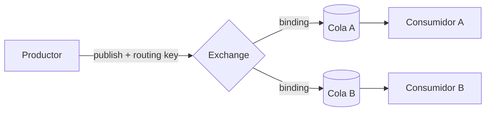

# Etapa 1 — Vocabulario de mensajería

## 🎯 Objetivo de la etapa

Quedarte con el vocabulario base de mensajería **bien claro**, porque todo lo demás se apoya acá: evento, mensaje, cola, exchange, routing key, binding, productor/consumidor, ack/nack, prefetch y DLQ. Y entender los **tres tipos de exchange** (fanout, topic, direct) con los exchanges reales de GWP como ejemplo.

---

## 📖 Teoría

### Evento vs mensaje

- Un **evento** es un *hecho de negocio que ya pasó*: "se recibió una solicitud de pago", "se confirmó un pago". Es conceptual, inmutable, en pasado.
- Un **mensaje** es el *sobre* que transporta ese evento por el broker: bytes (normalmente JSON) + metadatos (headers, routing key). El evento es el contenido; el mensaje es el envío.

> En tu mundo: el **evento** es el DTO/`record` con los datos del hecho; el **mensaje** es ese DTO ya serializado y metido en un sobre de RabbitMQ con su etiqueta de ruteo.

### Las piezas de RabbitMQ

RabbitMQ implementa el protocolo **AMQP**. Tres piezas y cómo se relacionan:

- **Exchange** — la "central de correo". El productor **nunca** publica directo a una cola: publica a un *exchange*, que decide a qué cola(s) mandar el mensaje.
- **Queue (cola)** — el casillero durable donde el mensaje espera a ser consumido. Es lo único que los consumidores leen.
- **Binding** — la "regla de ruteo" que conecta un exchange con una cola. Puede llevar una condición (un patrón de routing key).

- **Routing key** — etiqueta que el productor le pone al mensaje. El exchange la compara contra los bindings para decidir el ruteo. En GWP, por ejemplo, la routing key del webhook es el **código del proveedor** (`providerCode`).
- **Productor / Consumidor** — quién publica y quién lee. En GWP el api-gateway es casi puro productor; el payment-service es las dos cosas (consume 9 colas, publica a 6 exchanges).

> **Analogía Spring:** un `@RabbitListener` sobre una cola es, conceptualmente, como un consumidor que está dando vueltas tomando ítems de un `BlockingQueue` con un `Executor` dedicado — solo que la cola es **durable** (vive en el broker, no en tu heap), está **fuera de tu proceso**, y la entrega está **garantizada** por el protocolo.

### Ack / Nack: el apretón de manos

Esto es clave y no existe en una `BlockingQueue` común. Cuando un consumidor toma un mensaje, el broker **no lo borra todavía**: lo marca como "en vuelo". El consumidor procesa y después:

- **ack** (acknowledge): "lo procesé bien, borralo". Recién ahí desaparece de la cola.
- **nack** (negative ack): "no pude / falló". Según la config, el mensaje se **re-encola** (reintento) o se manda a la **DLQ**.

Si el consumidor **se cae antes de hacer ack**, el broker nota que la conexión murió y **vuelve a poner el mensaje en la cola** para que otro lo tome. Por eso decimos que la entrega es **at-least-once** (al menos una vez): el mensaje no se pierde, pero **puede llegar dos veces** (lo procesaste, te caíste antes del ack, y te lo redan). De ahí la importancia de la **idempotencia** — la vemos en la Etapa 5.

### Prefetch: cuántos mensajes "en mano" a la vez

El **prefetch** (`prefetch count`) limita cuántos mensajes sin-ack puede tener un consumidor en vuelo simultáneamente. Si es 1, el broker no te manda el siguiente hasta que hagas ack del actual: reparto parejo, ideal para tareas pesadas. Si es alto, el consumidor "acapara" muchos y procesa más rápido, pero si se cae, más mensajes vuelven a la cola.

> En tu mundo es como el **tamaño del lote** que un worker saca de la cola antes de volver a pedir. Prefetch bajo = justo a tiempo y reparto equitativo; prefetch alto = throughput pero menos balanceo.

### DLQ — Dead Letter Queue

La **cola de los muertos**. Si un mensaje falla repetidas veces (o se rechaza sin re-encolar, o expira), en vez de perderse o girar para siempre, se desvía a una **DLQ**. Ahí queda para que alguien lo inspeccione: ¿por qué falló?, ¿lo reproceso a mano?, ¿es un bug? Es tu red de seguridad contra el "veneno" (un mensaje que rompe siempre y bloquearía la cola si girara infinito).

### Los tres tipos de exchange

Acá está la decisión de diseño que más vas a ver. El **tipo de exchange** define *cómo* rutea:

#### 1. `fanout` — a todos, sin mirar la routing key

Copia el mensaje a **todas** las colas atadas a él. Ignora por completo la routing key. Es "broadcast".

> **Cuándo:** un mismo hecho le interesa a varios consumidores y no querés que el productor sepa cuántos son. Agregás un consumidor nuevo **atando otra cola** al exchange, sin tocar al productor.

En GWP: `on_new_payment_request` es **fanout, routing key `""`** (vacía, justamente porque no se usa). El gateway publica "llegó una solicitud" y el sistema decide quién la consume — sin que el gateway lo sepa.

#### 2. `topic` — por patrón de routing key

Rutea comparando la routing key contra **patrones** en los bindings, usando comodines: `*` (una palabra) y `#` (cero o más palabras), separadas por puntos. Flexible y declarativo.

> **Cuándo:** el mismo exchange recibe mensajes de distintas "categorías" y querés que cada cola se suscriba a un subconjunto.

En GWP: `on_new_webhook_notification` es **topic, con routing key = `providerCode`**. Así, las notificaciones de MercadoPago (`providerCode` de MP) pueden rutearse a la cola del adapter correcto, y mañana otro proveedor rutea a otro lado — **sin tocar al gateway**, solo agregando un binding.

#### 3. `direct` — por coincidencia exacta de routing key

Rutea a las colas cuyo binding tenga **exactamente** la misma routing key del mensaje. Sin comodines. Es el punto medio: más dirigido que fanout, más simple que topic.

> **Cuándo:** querés mandar a una cola específica según una clave exacta y previsible.

**Resumen mental:**

| Tipo | Mira la routing key | Reparte a… | Metáfora |
|------|:---:|---|---|
| `fanout` | No | todas las colas atadas | altavoz / lista de difusión |
| `topic` | Sí, por patrón (`*`, `#`) | las que matcheen el patrón | suscripción por temas |
| `direct` | Sí, exacta | las que tengan esa key exacta | sobre con destinatario puntual |

---

## 🔍 En nuestro sistema

Exchanges reales que ya conocés del contexto, y qué tipo son:

- **`on_new_payment_request`** — `fanout`, routing key `""`. El gateway difunde "llegó una solicitud de pago". Fanout porque al gateway no le importa quién la consume.
- **`on_new_webhook_notification`** — `topic`, routing key = `providerCode`. Rutea la notificación según el proveedor que la mandó.
- **`on_new_cancel_order_request`** y **`on_new_refund_order_request`** — los otros dos puntos de entrada del gateway (cancelación y reembolso).
- **`on_notification_attempt_completed`** — exchange de **auditoría** que publica el notification-service: registra el resultado de cada intento de notificación al cliente.

Y las piezas conceptuales aparecen así:
- **Productor puro:** api-gateway.
- **Productor + consumidor:** payment-service (9 colas in, 6 exchanges out) y mercadopago-adapter (6 colas in, 5 exchanges out).
- **DLQ + reintentos:** el mercadopago-adapter los usa explícitamente para tolerar fallas de la API de MercadoPago.

---

## 📂 Qué buscar en el código (para la semana)

- La **clase de configuración de RabbitMQ** (la que declara los `Exchange`, `Queue` y `Binding` como `@Bean`). Ahí vas a ver, en código, el **tipo** de cada exchange (`FanoutExchange`, `TopicExchange`, `DirectExchange`) y los bindings con sus routing keys.
- Buscá dónde se configura la **DLQ**: típicamente argumentos como `x-dead-letter-exchange` al declarar la cola, o beans de exchange/cola con "dlq"/"dead-letter" en el nombre.
- Buscá dónde se setea el **prefetch** (suele estar en `application.yml`/`.properties` como `spring.rabbitmq.listener.simple.prefetch`, o en la config del container factory).

---

## ❓ Preguntas para verificar que entendiste

1. ¿Por qué un productor publica a un **exchange** y no directamente a una cola? ¿Qué gana con esa indirección?
2. `on_new_payment_request` es `fanout` con routing key `""`. ¿Por qué la routing key está vacía y qué implica para agregar un nuevo consumidor?
3. ¿Qué diferencia hay entre que el payment-service haga **ack** o **nack** de un mensaje? ¿Qué pasa si se cae **antes** de cualquiera de los dos?
4. Explicá con tus palabras por qué "at-least-once" obliga a pensar en idempotencia.
5. ¿Para qué sirve una DLQ y qué problema concreto evita (pista: mensaje "veneno")?

---

## ✍️ Mini-ejercicio

Dibujá en una hoja los tres exchanges de entrada del gateway (`on_new_payment_request`, `on_new_webhook_notification`, y uno de cancel/refund). Para cada uno, anotá: **(a)** su tipo de exchange, **(b)** qué routing key usaría el productor, y **(c)** en una frase, por qué ese tipo es el adecuado para ese caso. Para el webhook, inventá un segundo proveedor ficticio y mostrá **qué tendrías que agregar** (sin tocar el gateway) para que sus notificaciones vayan a otra cola.

---

**Siguiente:** `etapa-2-rabbitmq-en-el-proyecto.md`
