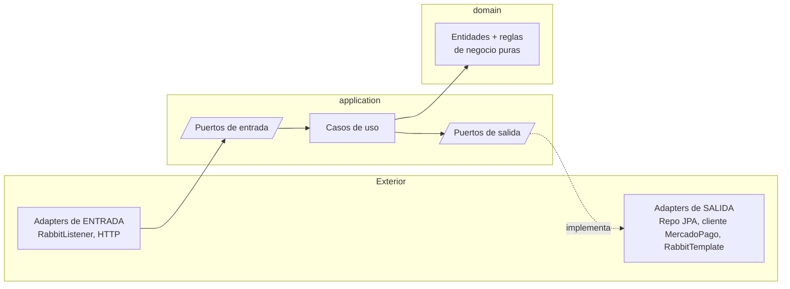

# Etapa 3 — Hexagonal + Clean + CQRS

## 🎯 Objetivo de la etapa

Entender **cómo está organizado por dentro** cada microservicio de GWP: las capas `domain` / `application` / `adapters`, los puertos de entrada y salida, la regla de dependencias hacia adentro, y por qué los **commands** están separados de los **events** y las **queries** (CQRS). Que veas que no es decoración: resuelve problemas concretos de testeo y de cambio.

---

## 📖 Teoría

### El problema que resuelve la arquitectura hexagonal

En el monolito clásico, ¿dónde vive la lógica de negocio? Muchas veces, mezclada con Spring, con JPA, con el cliente HTTP. El `@Service` importa `@Repository` (JPA), arma queries, llama clientes REST… y entonces tu **lógica de negocio depende de la base de datos, del framework y del proveedor externo**. Testearla te obliga a levantar media infraestructura, y cambiar de proveedor te obliga a tocar el corazón del negocio.

La **arquitectura hexagonal** (también "Ports & Adapters") da vuelta esa dependencia. La idea de una frase:

> **El negocio (dominio) no conoce el mundo exterior. El mundo exterior conoce al negocio.**

El dominio define **qué necesita** mediante interfaces (los **puertos**). El mundo exterior (base, RabbitMQ, MercadoPago) provee implementaciones de esas interfaces (los **adapters**). Las dependencias **apuntan siempre hacia adentro**, hacia el dominio.

### Las tres capas

- **`domain`** — el corazón. Entidades, reglas de negocio, invariantes. **Cero dependencias** de Spring, JPA o RabbitMQ. Es Java puro. Acá vive "una orden no puede reembolsarse si no fue confirmada", "un pago expira a los X minutos", etc.
- **`application`** — los **casos de uso** (orquestan el dominio) y la **definición de los puertos** (interfaces). Un caso de uso dice "para procesar una solicitud, valido con el dominio, persisto con el *puerto de repositorio*, y publico un evento con el *puerto de mensajería*". No sabe **quién** implementa esos puertos.
- **`adapters`** — el mundo real conectado a los puertos. Dos familias:
  - **Adapters de entrada** (*driving*): empujan al sistema desde afuera. En GWP, principalmente los `@RabbitListener` (y los controllers HTTP en el gateway). Toman un mensaje/request y llaman a un caso de uso.
  - **Adapters de salida** (*driven*): el sistema los usa para hablar con el mundo. El repositorio JPA, el cliente HTTP de MercadoPago, el publicador de RabbitMQ. Implementan los puertos de salida.

### La regla de oro: dependencias hacia adentro

`adapters` → `application` → `domain`. **Nunca al revés.** El `domain` no importa nada de `application`; `application` no importa nada de `adapters`. Por eso el negocio se testea sin levantar base ni broker: le pasás *mocks* de los puertos.

> **Analogía:** el puerto de salida `PaymentRepository` (interface en `application`) es como un `interface DAO` que vos definís según lo que **el negocio necesita** ("guardame esta orden", "traeme la orden por uuid"). El adapter JPA lo implementa. El caso de uso depende de **tu interface**, no de `JpaRepository`. Cambiás de PostgreSQL a otra cosa tocando solo el adapter; el negocio ni se entera.

### CQRS — separar lo que cambia de lo que pregunta

**CQRS** = *Command Query Responsibility Segregation*. La idea: separar las operaciones que **cambian estado** (commands) de las que **leen estado** (queries), en vez de mezclar todo en un "service" que hace ambas. En un sistema event-driven aparece una tercera categoría natural: los **eventos**.

Distinguilos así:

| Tipo | Intención | Tiempo verbal | Ejemplo conceptual |
|------|-----------|---------------|--------------------|
| **Command** | "hacé esto" — una orden que *puede* fallar/rechazarse | imperativo | "creá la orden en MercadoPago" |
| **Event** | "esto ya pasó" — un hecho, inmutable | pasado | `OnPaymentRequestReceivedEvent` |
| **Query** | "decime esto" — sin efectos | pregunta | "traeme el estado de la orden" |

Diferencia sutil pero importante: un **command** expresa *intención* y un destinatario puede rechazarlo; un **event** es un *hecho consumado* y a quien lo escucha solo le queda reaccionar. En GWP los **commands son inmutables (`record`)** — una vez creados no se tocan, lo que los hace seguros para pasar entre hilos y serializar.

> **Por qué importa acá:** el api-gateway recibe un request, lo valida y emite un **evento** (`OnPaymentRequestReceivedEvent`). El payment-service consume ese evento y, para que MercadoPago cree la orden, emite lo que conceptualmente es un **command** hacia el adapter. Separar estas intenciones evita el clásico "God Service" que hace todo y no se entiende.

### Y todo esto compilado a binario nativo (GraalVM)

Los 4 servicios se compilan a **binario nativo con GraalVM** (*ahead-of-time*). Para vos, dos consecuencias prácticas: arranque casi instantáneo y bajo consumo de RAM (ideal para muchos pods chicos en K8s), pero **menos reflexión dinámica** disponible — por eso hexagonal/CQRS con tipos explícitos y `record` encaja tan bien, y por eso a veces ves *hints* de configuración nativa. Es un dato a tener presente, no algo que tengas que dominar esta semana.

---

## 🔍 En nuestro sistema

Los **patrones transversales en los 4 servicios** son exactamente estos: Hexagonal, Clean Architecture (dependencias hacia adentro), CQRS, commands inmutables (`record`) y compilación nativa con GraalVM.

Cómo se nota servicio por servicio:

- **payment-service** — el caso más rico. Su `domain` tiene las reglas de la orden de pago (estados, expiración, condiciones de reembolso). Sus **puertos de entrada** son los `@RabbitListener` que reciben eventos; sus **puertos de salida** son el repositorio PostgreSQL y el publicador de eventos. Es el *Aggregate Root*: el dueño de la verdad del estado del pago.
- **mercadopago-adapter** — es, él mismo, un **adapter de salida del sistema** (encapsula MercadoPago), pero internamente también está organizado en capas: puerto de entrada (consume colas), dominio finito (traducir eventos GWP ↔ API MercadoPago), puerto de salida (el cliente HTTP real).
- **notification-service** — puerto de entrada (consume 2 colas), y un puerto de salida que es el POST HTTP firmado al cliente. Sus **12 extractores de metadatos por proveedor** son un **patrón Strategy** (lo vemos en Etapa 4): una interfaz, muchas implementaciones, se elige la del proveedor en runtime.
- **api-gateway** — más finito, pero igual separa: adapter de entrada (controllers HTTP) → caso de uso (validar + transformar a evento) → puerto de salida (publicar a RabbitMQ).

---

## 📂 Qué buscar en el código (para la semana)

- La **estructura de paquetes** de cada servicio: buscá carpetas/paquetes `domain`, `application`, `adapters` (o `infrastructure`/`adapter`). El árbol de paquetes te cuenta la arquitectura.
- En `application`: las **interfaces de puertos** (suelen tener nombres tipo `...Port`, `...Repository`, `...Publisher`, `...UseCase`) y las clases de **casos de uso**.
- En `adapters`: las **implementaciones** de esos puertos (el repo JPA, el cliente de MercadoPago, el publicador RabbitMQ, los `@RabbitListener`).
- En `domain`: confirmá que esas clases **no importan** `org.springframework.*` ni `jakarta.persistence.*`. Si el dominio está limpio, la regla de dependencias se respeta.
- Los **`record`** usados como commands/events.

---

## ❓ Preguntas para verificar que entendiste

1. ¿Por qué el `domain` no debe importar nada de Spring, JPA ni RabbitMQ? ¿Qué ganás concretamente con esa restricción?
2. ¿Qué es un **puerto de entrada** y qué es un **puerto de salida**? Dá un ejemplo de cada uno en el payment-service.
3. Diferenciá **command**, **event** y **query**. ¿Por qué `OnPaymentRequestReceivedEvent` es un evento y no un command?
4. ¿En qué dirección apuntan las dependencias entre `adapters`, `application` y `domain`, y por qué nunca al revés?
5. ¿Por qué tiene sentido que los commands sean `record` inmutables en un sistema que los serializa y los pasa entre hilos/servicios?

---

## ✍️ Mini-ejercicio

Tomá el caso de uso conceptual "procesar una solicitud de pago" del payment-service. En una hoja, escribí los **3-4 pasos** que haría el caso de uso (validar con el dominio, persistir, publicar evento…). Al lado de cada paso, marcá si usa el **dominio**, un **puerto de salida** o emite un **evento**. Después, identificá: si mañana cambian PostgreSQL por otra base, **¿qué capa(s) tocás y cuál NO?** Justificá en una línea.

---

**Siguiente:** `etapa-4-recorrido-microservicios.md`
