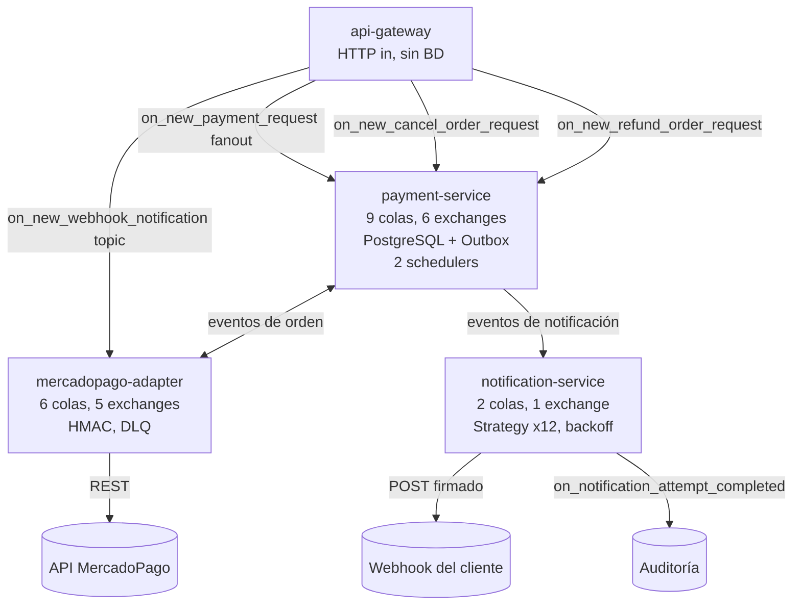

# Etapa 4 — Recorrido de los 4 microservicios

## 🎯 Objetivo de la etapa

Tener una **ficha mental clara de cada microservicio**: qué hace, qué consume, qué publica, sus casos de uso y qué buscar en su código. Al terminar deberías poder dibujar el sistema completo de memoria.

> Los **números de colas/exchanges** y los **nombres de exchanges/eventos** son los reales. Los nombres de **clases/archivos** los confirmás en el repo.

---

## 📖 Teoría (cómo leer una ficha de servicio)

Para cada servicio mirá siempre cuatro cosas, en este orden:

1. **Responsabilidad** — ¿de qué es dueño? ¿Tiene estado (BD) o es *stateless*?
2. **Entradas** — ¿qué colas consume? (Eso te dice a qué hechos reacciona.)
3. **Salidas** — ¿a qué exchanges publica? (Eso te dice qué hechos genera.)
4. **Forma** — ¿tiene HTTP? ¿schedulers? ¿patrones especiales?

Un servicio event-driven se entiende por **lo que escucha y lo que grita**, no por una API.

---

## 🔍 En nuestro sistema

### 4.1 — api-gateway

| | |
|---|---|
| **Responsabilidad** | Único punto de entrada HTTP. Valida, transforma requests en eventos, publica a RabbitMQ. |
| **Estado** | *Stateless*, **sin BD**. |
| **Servidor** | **Undertow**. |
| **Forma** | Responde `202`/`200` sin bloquear. Productor puro de eventos. |

**4 casos de uso (endpoint → evento → exchange):**

| Endpoint | Evento / destino | Exchange | Tipo / routing key |
|---|---|---|---|
| `POST /api/v1/payments` | `OnPaymentRequestReceivedEvent` | `on_new_payment_request` | fanout, rk `""` |
| `POST /api/v1/webhooks/{provider}/notifications` | notificación de webhook | `on_new_webhook_notification` | topic, rk = `providerCode` |
| `POST /api/v1/payments/{uuid}/cancel` | solicitud de cancelación | `on_new_cancel_order_request` | (entrada de cancelación) |
| `POST /api/v1/payments/{uuid}/refund` | solicitud de reembolso | `on_new_refund_order_request` | (entrada de reembolso) |

> **Idea:** el gateway es deliberadamente "tonto". No tiene reglas de negocio de pago; su trabajo es **traducir HTTP → evento** lo más rápido posible y soltar la conexión. Por eso usa Undertow (servidor liviano, eficiente con muchas conexiones concurrentes) y no necesita base.

---

### 4.2 — payment-service

| | |
|---|---|
| **Responsabilidad** | **Orquestador central / Aggregate Root.** Dueño de la verdad del estado de cada pago. |
| **Estado** | **PostgreSQL 16** (9 tablas) con **HikariCP**. |
| **Forma** | 100% event-driven, **sin endpoints HTTP**. Consume **9 colas**, publica a **6 exchanges**. |
| **Patrón clave** | **Transactional Outbox** (lo vemos a fondo en Etapa 5). |
| **Schedulers** | `ExpiredOrdersScheduler` (cada 5s) y `RefundInProgressScheduler` (cada 60s). |

**Transactional Outbox, en una frase:** cada evento que va a publicar se **persiste en la misma transacción** que la entidad de negocio. Se intenta publicar de una vía un `ApplicationEvent` de Spring; si esa publicación falla, un **scheduler de respaldo reintenta cada 3s (máx 3 intentos)**. Así nunca tenés "guardé el estado pero perdí el evento" (ni al revés). Casos idempotentes con **rollback automático**.

**Los schedulers internos** son la pieza que rompe la idea de "todo lo dispara un HTTP":
- `ExpiredOrdersScheduler` (5s): busca órdenes que vencieron sin pagarse y dispara su expiración. **Nadie hace un request para esto**: lo dispara el tiempo.
- `RefundInProgressScheduler` (60s): revisa reembolsos en curso y los hace avanzar/consultar estado.

> **Mentalidad:** este es el servicio donde más se nota el cambio respecto del monolito. No tiene puerta HTTP; **vive reaccionando a colas y a relojes internos**. Es el cerebro: decide, persiste y emite los próximos eventos.

---

### 4.3 — mercadopago-adapter

| | |
|---|---|
| **Responsabilidad** | Adaptador de **salida** (hexagonal) hacia MercadoPago. Encapsula TODA la integración con su API REST. |
| **Estado** | *Stateless*, **sin BD**. |
| **Forma** | Consume **6 colas**, publica **5 exchanges**. |
| **Integración** | `POST /v1/orders`, `GET /v1/orders/{id}`, `.../cancel`, `.../refund`. |
| **Seguridad** | Valida webhooks con **firma HMAC-SHA256**. **Token y webhook secret por cliente**. |
| **Resiliencia** | **Reintentos automáticos con DLQ**. Soporta **proxy HTTP corporativo**. |

> **Idea:** todo lo "sucio" de hablar con un tercero (autenticación por cliente, formato de la API, validación de firmas, reintentos cuando MercadoPago tira error o timeout) queda **encapsulado acá**. El resto del sistema no sabe que MercadoPago existe: solo conoce eventos GWP. Si mañana entra otro proveedor, idealmente nace otro adapter hermano, sin tocar al payment-service.

La **firma HMAC-SHA256** es cómo el adapter verifica que un webhook **vino de verdad de MercadoPago** y no de un impostor: MercadoPago firma el cuerpo con un secreto compartido (el *webhook secret*, distinto por cliente), y el adapter recalcula la firma y la compara. Si no coincide, descarta.

---

### 4.4 — notification-service

| | |
|---|---|
| **Responsabilidad** | Adaptador de **salida HTTP** hacia los clientes. Convierte eventos del payment-service en **HTTP POST firmados** a los webhooks de cada cliente. |
| **Estado** | **Sin BD.** |
| **Forma** | Consume **2 colas**, publica **1 exchange de auditoría** (`on_notification_attempt_completed`). |
| **Firma** | **HMAC-SHA256** sobre el POST que manda al cliente. |
| **Resiliencia** | **Backoff exponencial** (Spring Retry + Apache HttpClient 5), configurable por cliente. |
| **Patrón clave** | **12 extractores de metadatos** inyectados por proveedor → **Strategy**. |

**El patrón Strategy de los 12 extractores:** distintos proveedores meten la metadata del pago en lugares distintos del payload. En vez de un `if/else` gigante por proveedor, hay **una interfaz "extractor de metadatos" y 12 implementaciones**, una por proveedor. En runtime se elige la del proveedor correspondiente. Eso es Strategy puro: comportamiento intercambiable detrás de una interfaz común.

> **Analogía:** es el mismo patrón que cuando inyectás `List<Validator>` y elegís el que aplica según el tipo. Acá es `List<MetadataExtractor>` (o un `Map<provider, extractor>`) y se selecciona por proveedor.

**El backoff exponencial** es su forma de no rendirse al primer fallo ni martillar al cliente: si el webhook del cliente no responde, reintenta esperando cada vez más (1s, 2s, 4s, 8s…). Y cada intento — exitoso o no — se **audita** publicando a `on_notification_attempt_completed`.

---

### Vista integrada

---

## 📂 Qué buscar en el código (para la semana)

- **api-gateway:** los **controllers** (4 endpoints) y, en cada uno, la línea donde **publica el evento** y devuelve `202`/`200`. Confirmá que no hay acceso a BD.
- **payment-service:** contá los **`@RabbitListener`** (esperá ~9) y las publicaciones a exchanges (~6). Buscá la **tabla/entidad del Outbox** (algo tipo `outbox_events`) y los dos schedulers (`@Scheduled`, métodos cada 5s y 60s).
- **mercadopago-adapter:** el **cliente HTTP** de MercadoPago (puerto de salida), la **validación HMAC** del webhook, y la config de **DLQ/reintentos**. Buscá dónde se resuelven **token y secret por cliente**.
- **notification-service:** la **interfaz del extractor de metadatos** y sus **12 implementaciones** (Strategy), la config de **Spring Retry** (backoff), y dónde publica `on_notification_attempt_completed`.

---

## ❓ Preguntas para verificar que entendiste

1. ¿Por qué el api-gateway no tiene base de datos y el payment-service sí? ¿Qué dice eso sobre la responsabilidad de cada uno?
2. El payment-service no tiene endpoints HTTP. Entonces, ¿de qué dos formas "le llegan cosas para hacer"?
3. ¿Qué encapsula el mercadopago-adapter que el resto del sistema **no** debería conocer? Dá dos ejemplos.
4. Explicá el patrón Strategy de los 12 extractores: ¿qué problema evita frente a un `switch` por proveedor?
5. ¿Para qué publica el notification-service a `on_notification_attempt_completed` si nadie "necesita" ese evento para el flujo principal?

---

## ✍️ Mini-ejercicio

Hacé **cuatro fichas** (una por servicio) en una tarjeta cada una, con solo 4 renglones: **(1)** ¿tiene BD?, **(2)** ¿tiene HTTP?, **(3)** ¿cuántas colas consume?, **(4)** ¿cuántos exchanges publica? Tapá el documento y completá de memoria. Después verificá. El objetivo es que el "esqueleto" del sistema te quede grabado antes de los flujos de la Etapa 6.

---

**Siguiente:** `etapa-5-patrones.md`
