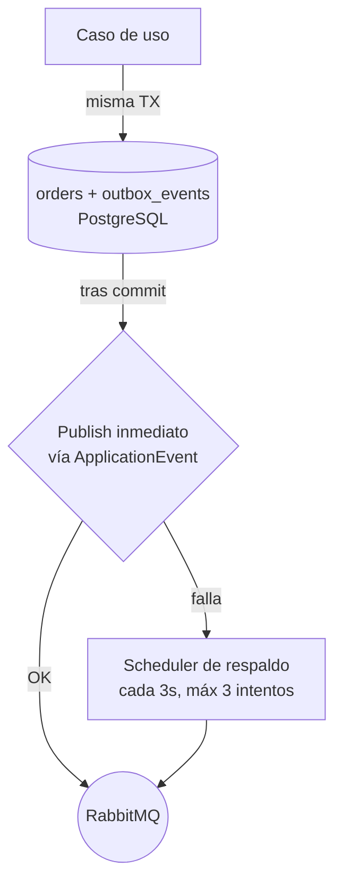

# Etapa 5 — Patrones que tenés que entender sí o sí

## 🎯 Objetivo de la etapa

Dominar los patrones que hacen que un sistema event-driven sea **confiable** y no un caos de mensajes perdidos: **Transactional Outbox, idempotencia, consistencia eventual, entrega at-least-once, reintentos y backoff, DLQ y schedulers**. Para cada uno: qué problema resuelve y dónde aparece en GWP.

Esta es **la etapa más importante del documento.** Si entendés esto, el código después se lee solo.

---

## 📖 Teoría

### 5.1 — El problema raíz: el "dual write"

Imaginá el payment-service procesando un evento. Tiene que hacer **dos cosas**: (a) guardar el nuevo estado en PostgreSQL y (b) publicar un evento a RabbitMQ para que el flujo siga. Son **dos sistemas distintos**. Y acá está la trampa:

```java
// EL BUG CLÁSICO — no hagas esto
@Transactional
public void handle(Event e) {
    repo.save(order);                 // (a) commit en PostgreSQL
    rabbitTemplate.send(nextEvent);   // (b) publish en RabbitMQ
}
```

¿Qué pasa si la app se cae **entre (a) y (b)**? Guardaste el estado pero **nunca publicaste el evento**. El pago quedó "confirmado" en tu base pero el adapter nunca se enteró: flujo cortado, plata en el limbo. Y al revés es peor: si publicás primero y el commit de la base falla, mandaste un evento sobre algo que **no pasó**.

No podés meter PostgreSQL y RabbitMQ en una sola transacción atómica (sin transacciones distribuidas, que son caras y frágiles). Este es el problema del **dual write**, y la solución es el Outbox.

### 5.2 — Transactional Outbox

La idea es elegante: **convertí el dual write en un single write.** En vez de escribir a dos sistemas, escribí a **uno solo** (PostgreSQL) y dejá que un proceso aparte se encargue de publicar.

Cómo funciona:

1. En la **misma transacción** que guardás la entidad de negocio, insertás una fila en una tabla **`outbox_events`** con el evento a publicar (serializado). Una sola transacción, atómica: o se guardan **las dos cosas** o **ninguna**.
2. Después de commitear, intentás **publicar de una** (en GWP, vía un `ApplicationEvent` de Spring que dispara la publicación a RabbitMQ tras el commit).
3. Si esa publicación inmediata **falla** (RabbitMQ no responde, red caída), no pasa nada grave: el evento **ya está guardado en `outbox_events`**. Un **scheduler de respaldo reintenta cada 3 segundos (máx 3 intentos)** publicando los eventos pendientes de la tabla.
4. Cuando se publica con éxito, se marca el evento como enviado (o se borra de la tabla).



> **Por qué es genial:** transformaste "guardar estado Y publicar evento, atómicamente" (imposible entre dos sistemas) en "guardar estado Y registrar la intención de publicar, atómicamente" (trivial, es una sola base). La publicación real se vuelve un detalle reintentable que **nunca pierde el evento**.

**En GWP:** lo implementa el **payment-service**. Tabla `outbox_events`, publish inmediato vía `ApplicationEvent` + scheduler de respaldo cada 3s (máx 3 intentos). Casos idempotentes con **rollback automático**.

### 5.3 — Entrega at-least-once

Recordá de la Etapa 1: el mensaje no se borra hasta el **ack**. Si el consumidor se cae después de procesar pero antes de ackear, el broker **redan** el mensaje. Conclusión inevitable:

> En este tipo de sistemas, un mensaje puede entregarse **más de una vez**. No es un bug: es la garantía *at-least-once*. La alternativa (*at-most-once*) perdería mensajes, y en pagos eso es inaceptable.

Sumale que el Outbox también puede publicar dos veces (publicó, se cayó antes de marcarlo como enviado, el scheduler lo reintenta). Doble motivo para lo que sigue.

### 5.4 — Idempotencia

**Idempotente** = procesar el mismo mensaje N veces tiene el **mismo efecto** que procesarlo una vez. Es la **contramedida obligatoria** del at-least-once.

> **Analogía:** `set saldo = 100` es idempotente (lo corras 1 o 5 veces, queda 100). `saldo = saldo + 100` **no lo es** (lo corrés 3 veces y sumaste 300). En pagos, "confirmar la orden #123" tiene que ser idempotente: si el evento de confirmación llega dos veces, la orden se confirma una sola vez, no cobrás dos veces.

Cómo se logra, en general:
- Detectar duplicados por una **clave de negocio** (el `uuid` de la orden, un id de evento): "¿ya procesé esto? entonces no hago nada".
- Diseñar las operaciones como **transiciones de estado idempotentes** ("confirmar" sobre algo ya confirmado = no-op).

**En GWP:** el contexto menciona explícitamente **"casos idempotentes con rollback automático"** en el payment-service. Es decir: si un evento ya fue procesado (o si su procesamiento viola una invariante), se descarta/revierte sin duplicar efectos.

### 5.5 — Consistencia eventual

Como cada servicio tiene su propio estado y se comunican por eventos asíncronos, **el sistema no está perfectamente coherente en todo instante**. Hay una ventana — milisegundos a segundos — donde el payment-service ya confirmó el pago pero el notification-service todavía no avisó al cliente. Al rato, todo converge.

> **El cambio de chip:** venís de transacciones ACID donde, al commitear, **todo** está coherente *ya*. Acá aceptás que la coherencia llega *después* ("eventualmente"). A cambio, ganás desacople y disponibilidad. La clave es que el sistema **converge** a un estado correcto, y mientras tanto nunca pierde información (gracias a colas + Outbox + reintentos).

### 5.6 — Reintentos y backoff

Cuando un consumidor falla por algo **transitorio** (MercadoPago tuvo un timeout, el webhook del cliente devolvió 503), no querés rendirte ni martillar. **Reintentás**, idealmente con **backoff exponencial**: esperás cada vez más entre intentos (1s, 2s, 4s, 8s…), a veces con un poco de aleatoriedad (*jitter*) para no sincronizar reintentos.

**En GWP:**
- **mercadopago-adapter:** reintentos automáticos contra la API de MercadoPago, con **DLQ** cuando se agotan.
- **notification-service:** **backoff exponencial** con Spring Retry + Apache HttpClient 5, **configurable por cliente** (cada cliente puede tolerar reintentos distintos).

### 5.7 — DLQ como red de seguridad

Si un mensaje falla y falla y falla (un *poison message*: payload corrupto, un bug que siempre explota), reintentarlo para siempre **bloquearía la cola** y quemaría recursos. La **DLQ** lo saca de circulación: lo deriva a una cola aparte para inspección humana. El flujo sano sigue; el problemático queda aislado y visible.

> **Regla de oro operativa:** una DLQ que crece es una **alarma**. Significa "hay mensajes que ningún reintento pudo procesar — vení a mirar". En la Etapa 8 vemos cómo investigarla.

### 5.8 — Schedulers (cuando el disparador es el tiempo)

No todo lo dispara un mensaje o un HTTP. Algunas cosas las dispara **el reloj**. En event-driven los schedulers cumplen dos roles típicos:

1. **Respaldo de entrega:** el scheduler del Outbox (cada 3s) que publica lo que el publish inmediato no pudo.
2. **Reglas de negocio temporales:** cosas que "pasan solas" con el tiempo.

**En GWP**, el payment-service tiene:
- `ExpiredOrdersScheduler` (**cada 5s**): expira órdenes QR que vencieron sin pagarse.
- `RefundInProgressScheduler` (**cada 60s**): hace avanzar/consulta reembolsos en curso.

> **Analogía:** es tu `@Scheduled` de toda la vida. La diferencia es el rol que cumple: acá el scheduler es a la vez **red de seguridad** del mensaje (Outbox) y **fuente de eventos** (la expiración no la pide nadie; la dispara el tiempo y genera un evento que recorre el sistema).

---

## 🔍 En nuestro sistema — tabla resumen

| Patrón | Dónde vive en GWP | Qué problema resuelve |
|---|---|---|
| Transactional Outbox | payment-service (`outbox_events`, publish + scheduler 3s/máx 3) | dual write: no perder ni inventar eventos |
| Idempotencia | payment-service (casos idempotentes + rollback) | duplicados por at-least-once |
| At-least-once | todo el sistema (ack/nack de RabbitMQ) | no perder mensajes |
| Consistencia eventual | todo el sistema | desacople sin transacción distribuida |
| Reintentos + DLQ | mercadopago-adapter | fallas transitorias de MercadoPago |
| Backoff exponencial | notification-service (Spring Retry, por cliente) | webhooks de cliente caídos/lentos |
| Schedulers | payment-service (Outbox 3s, expiración 5s, refunds 60s) | respaldo de entrega + reglas temporales |

---

## 📂 Qué buscar en el código (para la semana)

- La **entidad/tabla del Outbox** (`outbox_events` o similar) y la clase que **inserta el evento en la misma transacción** que la entidad. Buscá el uso de un `ApplicationEvent` de Spring publicado **tras el commit** (mirá `@TransactionalEventListener` con `phase = AFTER_COMMIT`, o un `ApplicationEventPublisher`).
- El **scheduler del Outbox** (un `@Scheduled` cada ~3s que recorre eventos pendientes) y la lógica de **máx 3 intentos**.
- La **detección de idempotencia**: dónde se chequea "¿ya procesé este evento/uuid?" antes de aplicar efectos.
- En el adapter, la config de **reintentos + DLQ** (argumentos `x-dead-letter-*`, política de retry).
- En el notification-service, la config de **Spring Retry / backoff** (anotaciones `@Retryable`/`@Backoff` o config programática) y dónde se lee la política **por cliente**.
- Los dos **`@Scheduled`** del payment-service (5s y 60s).

---

## ❓ Preguntas para verificar que entendiste

1. Explicá el problema del **dual write** con tus palabras. ¿Por qué un `@Transactional` que guarda en la base y publica a RabbitMQ **no** lo resuelve?
2. ¿Cómo convierte el Outbox un "dual write" en un "single write"? ¿Qué rol cumple el scheduler de respaldo?
3. ¿Por qué la entrega *at-least-once* **obliga** a que los consumidores sean idempotentes? Dá un ejemplo de operación idempotente y uno que no lo sea en un contexto de pagos.
4. ¿Qué es la consistencia eventual y por qué es un costo aceptable acá? ¿En qué momento del flujo de pago se nota esa ventana?
5. ¿Cuándo un mensaje termina en la DLQ y por qué una DLQ que crece es una señal de alarma?

---

## ✍️ Mini-ejercicio

Trazá el Outbox a mano. Dibujá la línea de tiempo del payment-service procesando un evento, con estos hitos: **TX abre → save(order) → insert(outbox_events) → TX commit → publish inmediato → ¿OK?**. Ahora **rompé el sistema en 3 lugares distintos** (caída antes del commit, caída justo después del commit pero antes del publish, fallo del publish inmediato) y para cada caso escribí: **¿qué quedó en la base?** y **¿quién termina publicando el evento?**. La conclusión que buscás: en ningún caso se pierde el evento.

---

**Siguiente:** `etapa-6-flujos-end-to-end.md`
