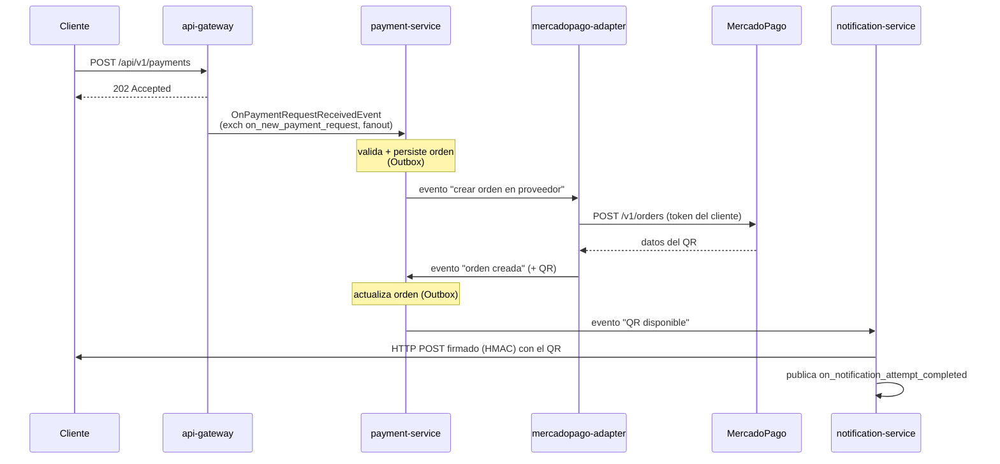
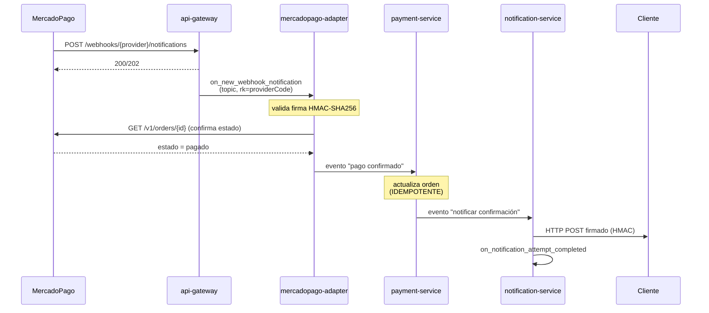
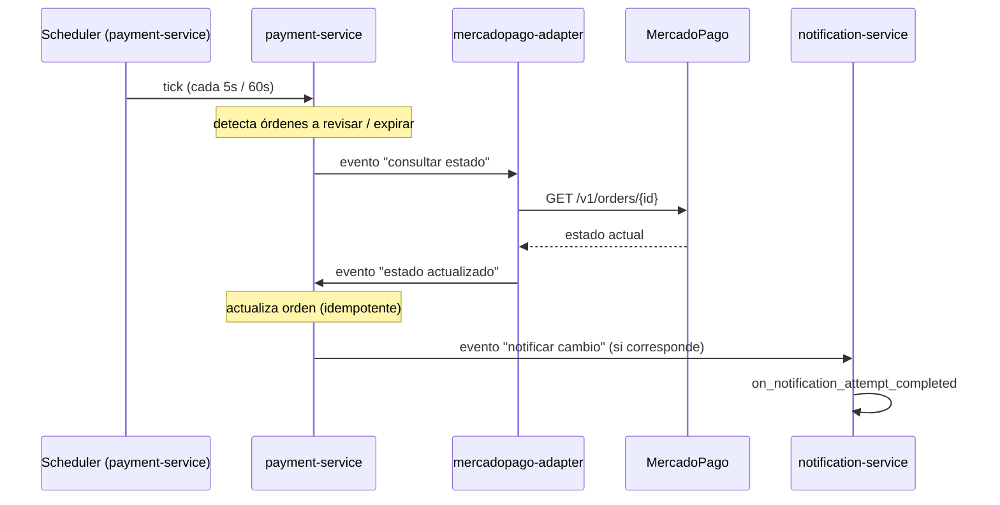
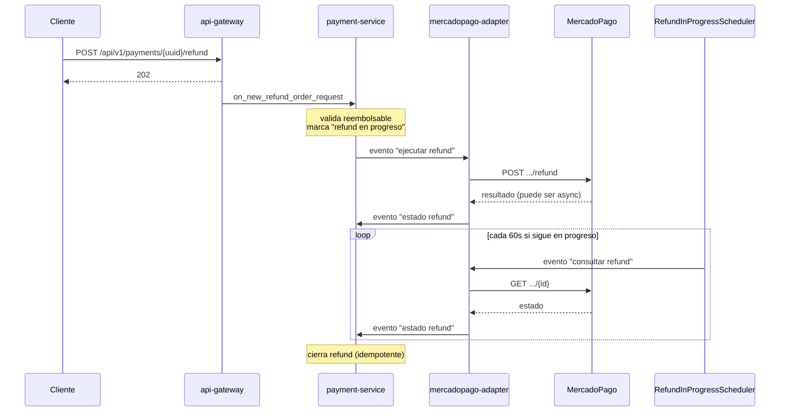
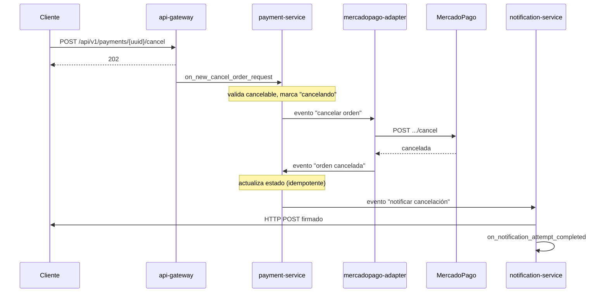

# Etapa 6 — Flujos end-to-end

## 🎯 Objetivo de la etapa

Seguir un mensaje **paso a paso, salto por salto, por los 4 servicios**, en los 5 flujos que existen en GWP. Al terminar deberías poder responder, para cualquier flujo: *¿qué evento se emite, a qué exchange, con qué routing key, a qué cola llega y qué caso de uso lo consume?*

> **Nota de honestidad:** los **nombres de los 4 exchanges de entrada** (`on_new_payment_request`, `on_new_webhook_notification`, `on_new_cancel_order_request`, `on_new_refund_order_request`) y el de auditoría (`on_notification_attempt_completed`) son reales. Los **exchanges/colas intermedios** entre payment-service ↔ adapter ↔ notification **no están nombrados** en la doc de arquitectura, así que acá los describo por su **función** (ej. "evento de orden creada"), no con un nombre inventado. Confirmá los nombres exactos en la clase de configuración de RabbitMQ cuando tengas el repo.

---

## 📖 Cómo leer un flujo

Cada salto entre servicios tiene **siempre** la misma anatomía. Entrenate a identificarla:

```
[Servicio A] --emite--> EVENTO --a--> EXCHANGE (tipo, routing key) --binding--> COLA --consume--> [Servicio B / caso de uso]
```

Si para cada salto podés completar esos casilleros, entendiste el flujo. Vamos.

---

## 🔍 Flujo 1 — Solicitud de pago → generación de QR

El cliente quiere cobrar; el sistema genera una orden QR en MercadoPago y se la devuelve (asíncronamente) al cliente.

**Paso a paso:**

1. **Cliente → api-gateway:** `POST /api/v1/payments`. El gateway valida, arma `OnPaymentRequestReceivedEvent`, lo publica a **`on_new_payment_request`** (fanout, rk `""`) y responde **`202`**.
2. **api-gateway → payment-service:** el evento llega a la cola del payment-service. Su caso de uso "procesar solicitud de pago" valida con el dominio, **persiste la orden** (estado inicial) y, vía **Outbox**, emite un evento "hay que crear la orden en el proveedor".
3. **payment-service → mercadopago-adapter:** el adapter consume ese evento, llama a **`POST /v1/orders`** de MercadoPago (con el token del cliente), recibe los datos del QR y **emite un evento "orden creada en el proveedor"** (con el QR/datos).
4. **mercadopago-adapter → payment-service:** el payment-service consume la respuesta, **actualiza la orden** con el QR (misma mecánica Outbox) y emite un evento "orden lista / QR disponible".
5. **payment-service → notification-service:** el notification-service consume ese evento, arma un **HTTP POST firmado (HMAC)** y lo manda al webhook del cliente con el QR. Publica el resultado a **`on_notification_attempt_completed`** (auditoría).



> **Fijate** que el cliente recibió su `202` en el paso 1, muchísimo antes de que el QR estuviera listo. Cuando el QR está, se entera **por su webhook**. Eso es asincronía pura.

---

## 🔍 Flujo 2 — Confirmación de pago (webhook de MercadoPago, happy path)

El usuario final pagó el QR. MercadoPago avisa por webhook; el sistema confirma y notifica.

**Paso a paso:**

1. **MercadoPago → api-gateway:** `POST /api/v1/webhooks/{provider}/notifications`. El gateway publica a **`on_new_webhook_notification`** (topic, rk = `providerCode`) y responde rápido.
2. **api-gateway → mercadopago-adapter:** la notificación rutea (por `providerCode`) a la cola del adapter. El adapter **valida la firma HMAC-SHA256** del webhook con el *secret* del cliente. Si es válida, normalmente **consulta el estado real** con `GET /v1/orders/{id}` (no confía solo en el aviso) y emite un evento "pago confirmado".
3. **mercadopago-adapter → payment-service:** el payment-service consume "pago confirmado", **actualiza la orden a confirmada** de forma **idempotente** (si el webhook llega dos veces, confirma una sola), y emite un evento "pago confirmado al cliente".
4. **payment-service → notification-service:** notifica al cliente con POST firmado y audita el intento.



> **El detalle de oro:** el paso 3 es idempotente *a propósito*. MercadoPago puede mandar el webhook más de una vez, y RabbitMQ puede redan el mensaje (at-least-once). El pago se confirma **una sola vez**.

---

## 🔍 Flujo 3 — Consulta de cambio de estado (disparada por scheduler)

Este flujo **no empieza con un HTTP**. Lo dispara el **tiempo**. Es el ejemplo perfecto de "fuente de eventos = reloj".

**Paso a paso:**

1. **Scheduler (payment-service):** el `RefundInProgressScheduler` (cada 60s) o la lógica de polling de estado detecta órdenes que necesitan que se consulte su estado real en el proveedor, y emite un evento "consultar estado de la orden". (El `ExpiredOrdersScheduler`, cada 5s, es la variante que **expira** órdenes vencidas y emite "orden expirada".)
2. **payment-service → mercadopago-adapter:** el adapter consume, hace **`GET /v1/orders/{id}`** y emite un evento con el estado actualizado.
3. **mercadopago-adapter → payment-service:** el payment-service actualiza la orden (idempotente) y, si corresponde, emite un evento para **notificar el cambio al cliente**.
4. **payment-service → notification-service:** notifica y audita.



> **Lo nuevo para vos:** acá no hay request del cliente. El sistema "se mueve solo". En un monolito esto sería un `@Scheduled` que llama un service; acá el scheduler **emite un evento** y deja que el flujo event-driven haga el resto.

---

## 🔍 Flujo 4 — Reembolso de pago

El cliente pide devolver un pago ya confirmado.

**Paso a paso:**

1. **Cliente → api-gateway:** `POST /api/v1/payments/{uuid}/cancel`… no — reembolso es `POST /api/v1/payments/{uuid}/refund`. El gateway publica a **`on_new_refund_order_request`** y responde rápido.
2. **api-gateway → payment-service:** consume la solicitud, valida con el dominio que **la orden sea reembolsable** (regla de negocio: tiene que estar confirmada, etc.), marca la orden "reembolso en progreso" y emite un evento "ejecutar reembolso en proveedor".
3. **payment-service → mercadopago-adapter:** el adapter llama a **`.../refund`** de MercadoPago y emite el resultado.
4. **mercadopago-adapter → payment-service:** actualiza el estado del reembolso. Acá entra el **`RefundInProgressScheduler` (60s)**: si el reembolso queda "en progreso" (MercadoPago a veces los procesa async), el scheduler lo hace avanzar consultando estado hasta cerrarlo.
5. **payment-service → notification-service:** notifica el reembolso al cliente y audita.



---

## 🔍 Flujo 5 — Cancelación de orden

El cliente cancela una orden **antes** de que se pague (típicamente, una orden QR todavía pendiente).

**Paso a paso:**

1. **Cliente → api-gateway:** `POST /api/v1/payments/{uuid}/cancel`. Publica a **`on_new_cancel_order_request`** y responde rápido.
2. **api-gateway → payment-service:** valida que la orden **sea cancelable** (no pagada aún), marca "cancelando" y emite "cancelar orden en proveedor".
3. **payment-service → mercadopago-adapter:** llama a **`.../cancel`** de MercadoPago y emite el resultado.
4. **mercadopago-adapter → payment-service:** actualiza la orden a "cancelada" (idempotente) y emite "notificar cancelación".
5. **payment-service → notification-service:** notifica y audita.



> **Relación con el Flujo 3:** una orden que **nadie cancela ni paga** termina expirando sola gracias al `ExpiredOrdersScheduler` (5s). Cancelación = el cliente lo pide; expiración = lo dispara el reloj. Mismo destino (orden cerrada), distinto disparador.

---

## 📂 Qué buscar en el código (para la semana)

- Para cada flujo, arrancá por el **caso de uso de entrada en el payment-service** (el `@RabbitListener` que consume el primer evento) y seguí **qué evento publica** al final. Eso te da el "siguiente salto".
- Cruzá cada **publicación** con el **binding** correspondiente en la config de RabbitMQ para confirmar exchange + routing key + cola destino.
- En el adapter, ubicá las 4 llamadas REST (`POST /v1/orders`, `GET /v1/orders/{id}`, `.../cancel`, `.../refund`) y qué evento dispara cada respuesta.
- Confirmá los **nombres reales** de los exchanges/colas intermedios que acá describí por función.

---

## ❓ Preguntas para verificar que entendiste

1. En el Flujo 1, ¿en qué momento exacto el cliente recibe respuesta del gateway, y cómo se entera después de que el QR está listo?
2. En el Flujo 2, ¿por qué el adapter hace `GET /v1/orders/{id}` en vez de confiar directamente en el contenido del webhook?
3. El Flujo 3 no tiene un actor "Cliente" al inicio. ¿Quién lo dispara y qué lo hace distinto de los demás?
4. En el Flujo 4, ¿qué rol cumple el `RefundInProgressScheduler` y por qué hace falta un loop de consulta?
5. Para **cualquier** salto entre dos servicios, ¿cuáles son los 5 casilleros que tenés que poder completar?

---

## ✍️ Mini-ejercicio

Elegí el **Flujo 2** (confirmación de pago). En una hoja, listá **cada cola que el mensaje atraviesa** desde que MercadoPago manda el webhook hasta que el cliente recibe la notificación, y **contá cuántas son**. Para cada cola, anotá qué servicio la consume. Después marcá **los dos puntos del flujo donde la idempotencia es indispensable** y explicá en una línea qué saldría mal sin ella.

---

**Siguiente:** `etapa-7-infraestructura.md`
