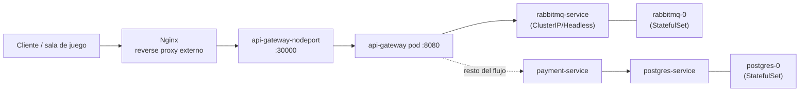

# Etapa 7 — Infraestructura y "verlo correr"

## 🎯 Objetivo de la etapa

Entender **dónde y cómo corre** GWP: contenedores, Kubernetes/Minikube, el namespace `dev`, y las piezas (pods, deployments, services, configmaps, secrets). Y, sobre todo, tener una **guía concreta** para levantarlo localmente, mandar una solicitud de prueba y **ver los mensajes pasando por RabbitMQ**.

> Esta etapa es la más "manos" del documento. Cuando tengas acceso al cluster, volvé acá con la compu al lado.

> 📎 **Si Docker/Kubernetes te suenan nuevos:** esta etapa te enseña a **operar** el sistema (mirar pods, abrir la UI, ver logs). Para entender la **maquinaria por dentro** — imagen vs contenedor, cómo un Service encuentra a sus pods (labels/selectors), DNS interno, ConfigMap/Secret, PV/PVC, la jerarquía Deployment→ReplicaSet→Pod y los gotchas de Minikube — leé el **Apéndice A — Fundamentos de Docker y Kubernetes**. Esta etapa asume esos conceptos; el apéndice los construye desde cero.

---

## 📖 Teoría

### Contenedores, rapidísimo

Venís de desplegar `.jar`/`.war` en un servidor con un Tomcat instalado. Un **contenedor** empaqueta tu app **+ todo lo que necesita** (runtime, libs, config) en una unidad que corre igual en cualquier lado. En GWP, además, los servicios se compilan a **binario nativo con GraalVM**, así que el contenedor lleva un ejecutable que arranca en milisegundos y consume poca RAM — ideal para correr varios pods chicos.

> **Analogía:** si el `.jar` era "te paso el plato y vos poné la mesa (JVM, config, etc.)", el contenedor es "te paso la vianda lista, abrila y comé". Misma vianda en tu máquina, en CI y en el cluster.

### Kubernetes en 6 sustantivos

Kubernetes (K8s) **orquesta** contenedores: decide en qué máquina corre cada uno, los reinicia si se caen, los conecta entre sí. GWP corre sobre **Minikube** (un K8s de **1 nodo** para desarrollo local). Los conceptos que vas a tocar:

| Concepto | Qué es | Analogía |
|---|---|---|
| **Pod** | la unidad que corre tu contenedor (1 o más) | un proceso corriendo |
| **Deployment** | declara "quiero N réplicas de este pod" y las mantiene | un supervisor que reinicia procesos caídos |
| **Service** | un nombre/IP estable para llegar a los pods (que van y vienen) | un DNS interno / balanceador |
| **ConfigMap** | configuración no secreta (URLs, flags) inyectada al pod | un `application.yml` externo |
| **Secret** | configuración sensible (tokens, secrets de webhook, password de PG) | una bóveda de credenciales |
| **Namespace** | una "carpeta" lógica que aísla recursos | un environment (`dev`) |

**En GWP:** todo vive en el namespace **`dev`** — por eso **todos los comandos llevan `-n dev`**. Cada microservicio es un **Deployment con 1 réplica**. RabbitMQ y PostgreSQL no son deployments comunes sino **StatefulSets** (`rabbitmq-0`, `postgres-0`), porque tienen **estado/identidad estable** (un StatefulSet le da a cada pod un nombre fijo y almacenamiento persistente — clave para una base o un broker).

### Tipos de Service que vas a ver

- **NodePort** — expone un puerto del nodo hacia afuera. El **api-gateway** se expone así: `api-gateway-nodeport :30000` → `:8080` del pod.
- **ClusterIP** — solo accesible *dentro* del cluster (la mayoría de los servicios internos).
- **Headless** — sin IP propia; se usa con StatefulSets para resolver cada pod por nombre (`rabbitmq-0`, `postgres-0`).

### Cómo entra el tráfico



**Nginx** es el reverse proxy externo: recibe el tráfico de afuera y lo manda al NodePort del gateway (`:30000`), que adentro llega al `:8080` del pod. De ahí en más, todo es RabbitMQ.

### Las dos piezas con estado

- **RabbitMQ** — el broker. AMQP en **`5672`** (por donde hablan los servicios) y **UI Management en `15672`** (por donde mirás vos). StatefulSet `rabbitmq-0`.
- **PostgreSQL 16** — base `payment_db` en **`:5432`**, usada **solo** por el payment-service. StatefulSet `postgres-0`.

---

## 🔍 En nuestro sistema — guía práctica

### 1. Ver qué está corriendo

```bash
kubectl get pods -n dev      # ¿están todos los pods Running?
kubectl get svc -n dev       # los services y sus puertos/tipos
```

Esperás ver, como mínimo: los 4 microservicios, `rabbitmq-0` y `postgres-0`. Si alguno está en `CrashLoopBackOff` o `Pending`, ahí empieza el troubleshooting (Etapa 8).

### 2. Abrir la UI de RabbitMQ (tu ventana al sistema)

```bash
kubectl port-forward -n dev svc/rabbitmq-service 15672:15672
# abrí http://localhost:15672  (user/pass suelen estar en un Secret/ConfigMap)
```

En la UI:
- **Exchanges:** confirmá tipos (fanout/topic/direct) y bindings.
- **Queues:** mirá la **profundidad** de cada cola (mensajes encolados). Esto es lo que más vas a usar: una cola que crece = consumidor lento o caído.
- Buscá la **DLQ**: si tiene mensajes, algo falló más de la cuenta.

### 3. Mandar una solicitud de prueba y observar

Idea del experimento (la secuencia exacta de comandos la ajustás con el repo):

1. Dejá abierta la UI de RabbitMQ en la vista de **Queues**.
2. Si el gateway no es accesible directo, exponelo: `kubectl port-forward -n dev svc/api-gateway-... 8080:8080` (o usá el NodePort `:30000` vía Minikube).
3. Mandá un `POST /api/v1/payments` (con `curl`/Postman) con un body de prueba.
4. **Mirá la magia:** verás un pico de tráfico en la cola del payment-service, después en la del adapter, después la del notification-service. El mensaje **viaja**. Eso que en la Etapa 6 dibujaste como `sequenceDiagram`, acá lo ves moverse en vivo.

### 4. Mirar logs

```bash
kubectl logs -n dev <pod-del-payment-service> -f      # -f = seguir en vivo
kubectl logs -n dev <pod-del-adapter> -f
```

Seguir los logs de los 4 servicios en paralelo mientras mandás un pago es **la mejor forma de ver el flujo event-driven con tus ojos**: ves cada servicio "despertarse" cuando le llega su evento.

### 5. Panorama visual (opcional)

```bash
minikube dashboard    # UI web con pods, deployments, services, etc.
```

### Comandos de bolsillo

```bash
kubectl get pods -n dev
kubectl get svc -n dev
kubectl describe pod -n dev <pod>          # eventos/errores de arranque
kubectl logs -n dev <pod> -f
kubectl port-forward -n dev svc/rabbitmq-service 15672:15672
minikube dashboard
```

---

## 📂 Qué buscar en el código / repo (para la semana)

- Los **manifiestos de Kubernetes** (carpeta tipo `k8s/`, `deploy/`, `manifests/`, o `.yaml` con `kind: Deployment`/`Service`/`StatefulSet`/`ConfigMap`/`Secret`). Ahí confirmás puertos, réplicas y nombres reales de services.
- El **ConfigMap** y el **Secret**: qué configuración recibe cada servicio (URL de RabbitMQ, datos de PostgreSQL, tokens y webhook secrets por cliente).
- El o los **Dockerfile** (probablemente *multi-stage* con build nativo GraalVM): confirma la compilación a binario nativo.
- La config de **Nginx** (reverse proxy) si está versionada.
- **Confirmá la versión de Java/Spring Boot** en el archivo de build (`pom.xml` → `<java.version>`, o `build.gradle`). Recordá: la doc dice **Java 21 / Spring Boot 3.5**, vos sospechabas Java 23 — este es el lugar donde lo verificás.

---

## ❓ Preguntas para verificar que entendiste

1. ¿Por qué RabbitMQ y PostgreSQL son **StatefulSets** (`rabbitmq-0`, `postgres-0`) y no Deployments comunes como los microservicios?
2. ¿Cuál es la diferencia entre un Service **NodePort** y uno **ClusterIP**, y por qué el api-gateway usa NodePort?
3. ¿Para qué sirve `kubectl port-forward -n dev svc/rabbitmq-service 15672:15672` y qué vas a hacer una vez conectado?
4. Si entrás a la UI de Management y la cola del payment-service crece sin parar mientras la del adapter está en 0, ¿qué sospechás y qué comando correrías para confirmar?
5. ¿Dónde viven los **tokens y webhook secrets por cliente** en este esquema de infraestructura, y por qué no en un ConfigMap?

---

## ✍️ Mini-ejercicio

Escribí en una hoja la **secuencia exacta de comandos** que correrías, en orden, para: (1) confirmar que todos los pods están arriba, (2) abrir la UI de RabbitMQ, (3) mandar un pago de prueba, y (4) seguir los logs del payment-service mientras lo hacés. No los ejecutes todavía (no tenés acceso aún): el objetivo es que el "runbook" te quede listo para el día que entres al cluster.

---

**Siguiente:** `etapa-8-consolidar.md`
